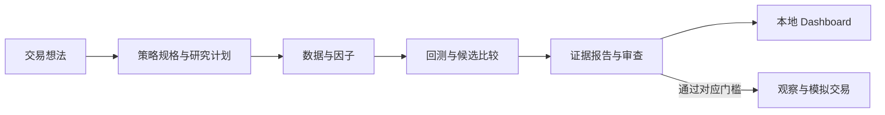

# Codex 的代码库分析与代码地图结论（2026-09-14）
本文件由 Fable 从 Codex 会话记录与 `docs/codemap/codemap.json` 的 `recommendation` 字段原样整理，未改写内容。
来源：Codex 会话 `rollout-2026-09-14T06-09-18`（分析消息时间 2026-09-14T06:31:17.524Z）；地图生成时间 2026-09-14T07:26:54Z，生成器 `codex-independent`。
Codex 的地图文件现在位于它自己的工作副本 `/root/codex-test/open-composer-codex-map/docs/codemap/`：`codemap.html`（2.2 MB，离线打开）、`codemap.json`、`codemap.lock`、生成器 `build_map.py`、模板 `viewer.html`。最新版生成于 2026-09-14 09:55 UTC：20 个首屏节点、300 条关系、5 条流程。它在 07:27 曾把 19 节点的早期版本写到本仓库 `docs/codemap/` 顶层，07:59 自行恢复了 Fable 的文件并迁出。本仓库 `docs/codemap/codemap.*` 现在是 Fable 的地图。

## 一、Codex 对项目的分析（原文）
我完成了一轮代码库梳理，重点阅读了策略模型、数据与因子、回测、研究流程、Dashboard、模拟交易和相关测试。以下评价基于**当前工作区，包括已有的未提交改动**；本次没有修改代码。

**我的总体判断：这是一个研究能力丰富、重视证据追溯的个人 AI 量化工作台。它已经有大量实际实现，但功能扩张快于架构整合，计算一致性、版本兼容和使用流程仍有明显缺口。**

从用途看，它希望让个人与 AI 协作，把交易想法变成可以验证、复现、审查和持续运行的策略。主要目标有三个：

- **工程目标**：把策略定义、数据、代码、试验和结论关联起来，避免研究过程散落在对话和临时脚本中。
- **研究目标**：通过样本外验证、成本压力、基准比较和消融实验，判断策略是否有效，以及 ML、LLM 是否提供了增量价值。
- **运行目标**：将合格策略接入观察和受控模拟交易。真实资金交易明确不在当前 MVP 范围内。

它设计上的流程是：

实现上，它采用**单机 Python 主程序、文件持久化、React 界面**的架构。JSON、YAML、JSONL 保存策略和研究状态，Parquet 与 DuckDB 处理市场数据。

| 环节 | 当前实现 |
|---|---|
| 策略定义 | [StrategySpec](open_composer/models/strategy_spec.py:1005) 用 Pydantic 描述交易规则、仓位、成本、模型和执行方式；表达式经过 AST 白名单检查。 |
| 数据与特征 | 通过能力注册表管理行情、新闻、宏观等来源；已有 SIP 档案、日内聚合、多个公开因子库和特征表。 |
| 回测与研究 | Python 参考引擎处理规则策略；`research/kernel` 提供候选评估、滚动验证和搜索；ML 模块负责训练与预测。 |
| 证据管理 | 迭代合同、候选清单、试验账本、来源卡和哈希绑定，记录研究依据与结果。 |
| 用户与 AI 协作 | CLI 执行任务；项目目录保存队列、上下文与轨迹；Dashboard 展示结果并发起受控操作。 |
| 执行 | NautilusTrader 承担部分事件驱动回测；专用适配器计算组合目标仓位；Alpaca Paper 路径检查授权、状态、数据与订单证据。 |

这里有几个实际边界：Python 策略主要由引擎直接解释规格，[Python 代码生成器](open_composer/compiler/spec_to_python.py:9)目前只生成占位文件；Pine 导出和 NautilusTrader 都只覆盖部分语义。默认 [FileQueue 后端](open_composer/agent_backend/file_queue.py:10)负责记录任务，任务是否继续执行取决于外部 Agent。当前新增的通用 Bar 运行器也仍限定在观察模式。

LLM 的作用分布在策略起草、候选选择、新闻或文档特征提取、信号解释与审阅等环节。特征先保存为带时间和来源信息的数据包，再参与回放；这有利于复现。部分入口默认使用确定性规则，因此不能仅凭“AI 研究”名称认定每次运行都调用了模型。

**我最认可的是，项目把研究纪律做进了代码。** 来源、时间可见性、参数搜索记录、模型与策略身份、模拟交易授权都有对应结构和校验。测试还包含独立参考计算，以及修改未来数据、检查历史选择是否变化的验证。这些比单纯输出漂亮回测图更有价值。

但以下问题直接影响成熟度评价。

1. **收益计算尚未统一，已经出现实质性差异。**

   我用两只股票做了合成数据对照：期初等权买入，一只先翻倍再回到原价，另一只价格不变。

   - 买入后持有的正确总收益是 **0%**，新内核得到 **0%**。
   - [旧研究脚本](scripts/evaluate_cross_sectional_momentum_liquid500.py:232)得到 **12.5%**，因为它隐含每日恢复等权，却只在显式调仓时计成本。
   - 在价格完全不变、首次建仓成本为单边 10 bps 的对照中，新内核扣除 **0.1%**，旧脚本扣除 **0.2%**。

   因此，不同研究路径的结果不能直接按同一口径比较。保留旧结果时，需要明确其计算版本和适用解释。

2. **当前策略格式扩展破坏了历史哈希兼容。**

   新增的六个 `event_*` 字段，即使旧策略没有使用，也进入了序列化结果；[哈希兼容逻辑](open_composer/strategy_versions.py:33)尚未排除它们，导致冻结合同校验失败。

   我对一个失败候选做了内存对照：仅移除这些未设置的空字段，哈希便恢复为合同中的值。这里既说明门禁在发挥作用，也说明格式演进机制还不稳定。

3. **文档推荐入口与后端要求没有接通。**

   [`oc research auto`](open_composer/cli.py:670)默认使用 `alpaca`，而[当前后端](open_composer/research/auto_research.py:130)只允许 `sample`，或带有效迭代 ID 的 `sip_parquet`。

   CLI 又没有提供迭代 ID 参数，因此文档中的默认命令不能按描述完成真实数据研究。另外，搜索预算校验函数虽然有单元测试，却没有接入这条主流程。这是端到端验收不足的具体表现。

4. **历史数据完整性仍有研究限制。**

   [股票池构建代码](open_composer/research/features/universe.py:14)明确记录：基础档案来自当前活跃股票列表，历史上已经退市的股票可能缺失。

   按历史流动性重建股票池是正确方向，但它不能自动补足退市、证券身份和历史覆盖缺口。不同股票池范围的结果，需要分别验证这些影响。

5. **Dashboard 已出现可测量的规模问题。**

   当前构建把整个研究目录数据嵌入 JavaScript，见 [Vite 配置](dashboard/vite.config.ts:46)。本次构建的主 JS 文件约 **34.7 MB**，gzip 后约 **1.4 MB**；输入目录 JSON 约 **45.1 MB**。

   同时，页面每 15 秒请求一次目录，服务端会重新构建目录数据。随着历史记录增长，这种实现会持续增加读取、传输和浏览器解析成本，适合改为摘要、分页与按需读取。

6. **研究实现与通用框架混杂，维护成本已经显现。**

   Python 主包约 **20.8 万行**，其中研究目录约占 **72%**；CLI 单文件约 **8,700 行、253 个顶层函数**，部分具体研究模块接近 9,000 行。

   大量按轮次命名的实现和兼容分支，保留了研究历史，却也让公共模型改动更容易影响多个旧实验。当前需要加强通用计算、实验专属逻辑和冻结证据之间的边界。

实际验证结果如下：

| 检查 | 结果 |
|---|---|
| 默认 Python 测试套件 | **2577 通过、57 失败、50 跳过**，耗时约 17 分钟 |
| Ruff | 1 处行长错误 |
| Dashboard 生产构建 | 通过，但主包体积过大 |

测试失败集中在冻结规格、候选清单和相关绑定检查；另有三个 Dashboard 跨域测试在完整套件中失败、单独运行时通过，提示测试顺序或环境隔离问题。此次没有启用 `--runslow`。完整记录见[测试日志](/tmp/open-composer-review-pytest-20260914.log)。

下一阶段，我建议先统一收益、持仓和成本核算并修复哈希兼容；随后选定一条“想法 → 数据 → 回测 → 报告 → 观察”的标准流程做完整验收；再处理 Dashboard 数据加载和研究模块拆分。策略效果则继续通过独立样本外证据评价，不能由代码量或审计记录数量推断。

## 二、Codex 早期版本（07:27，19 节点）内置的评估与建议（`recommendation` 字段，已被第三部分取代）

**决定：先精简主路径，再做边界清晰的重构**

理由：
- 个人使用的瓶颈是选择和验证成本，不是缺少策略模块。
- 将旧研究轮次保留为只读档案，把新研究统一到 StrategySpec → reference engine → report 路径。
- 收益、持仓漂移、成本和基准计算应收敛到一个公共实现后，再拆分大型模块。
- Dashboard 应从全量内嵌目录改为摘要与按需详情，避免历史数据使前端包持续膨胀。

阶段：

1. **主路径精简**
   - 保留 draft → validate → bounded research → report → observation 五步
   - 给真实数据 auto research 补齐 iteration_id 和数据源参数，移除文档与 CLI 默认不一致
   - 把旧轮次模块标为 archived/read-only

2. **计算内核收敛**
   - 统一 cross-sectional、kernel、engine 的持仓和交易成本定义
   - 所有结果携带 calculation_contract_id 与 version
   - 旧报告继续可读，禁止混入新比较

3. **安全与性能**
   - 修复 StrategySpec 新字段的语义哈希兼容
   - Dashboard catalog 分页、按策略加载、增量更新时间
   - 将测试 fixture 与真实/冻结合同测试彻底隔离

4. **小步重构**
   - 拆分 cli.py 按命令域
   - 为研究族抽象公共 runner/contract
   - 只在确定个人主用策略后继续增加 ML/LLM 角色

评估：

| 维度 | Codex 评语 |
|---|---|
| 质量 | 高：合同、来源、PIT、哈希和安全门槛覆盖广；但冻结合同兼容问题说明演进边界仍脆弱。 |
| 效率 | 中低：大量轮次复制、253 个 CLI 顶层函数和全量目录读取增加个人使用成本。 |
| 性能 | 中：研究使用 Parquet/DuckDB 控制内存，但 Dashboard 目录会增长为大包，且多套收益计算影响比较效率。 |
| 个人适用 | 中高：本地优先、sample 可运行、Paper 明确隔离，适合个人研究；需要先固定一条默认主路径。 |

发现（按严重度）：

| 编号 | 严重度 | 发现 | 证据 |
|---|---|---|---|
| calculation_consistency | high | kernel loop 与旧 cross-sectional 脚本对持仓漂移和交易成本的口径不同，结果不能直接比较。 | `open_composer/research/kernel/loop.py:599` returns_from_weight_schedule；`scripts/evaluate_cross_sectional_momentum_liquid500.py:232` _cohort_daily_returns |
| workflow_entrypoint | high | CLI 默认 auto research 数据源与后端真实数据授权条件不完全一致，文档主路径不能直接复现。 | `open_composer/cli.py:670` research_auto_command；`open_composer/research/auto_research.py:130` _require_real_data_authorization |
| version_hash | high | StrategySpec 新增未设置字段会影响历史冻结规格哈希，扩展合同需要兼容策略。 | `open_composer/models/strategy_spec.py:184` PortfolioConfig；`open_composer/strategy_versions.py:33` strategy_content_hash |
| dashboard_scale | medium | Dashboard Vite 构建将全量目录嵌入前端，历史信号增长会扩大包体和同步成本。 | `dashboard/vite.config.ts:7` dashboardCatalogResolver；`open_composer/dashboard/catalog.py:72` build_dashboard_catalog |
| pit_survivorship | medium | PIT 流动性股票池依赖当前活跃资产档案，退市覆盖仍是已记录的研究限制。 | `open_composer/research/features/universe.py:58` build_pit_universe_panel；`scripts/fetch_sip_universe.py:60` load_universe |

## 三、Codex 最新版（09:55，20 节点 / 300 关系）的评估（`assessment` 字段）

**决定：先修正确性，再精简个人主路径；以小步重构支撑，保留冻结证据。**

收益比较可信、每轮试验可复现、少重复计算、日常入口顺畅，才会提高个人策略迭代效率。拆文件和增加模块数量本身不创造 Alpha。

| 优先级 | 事项 | 涉及节点 | 建议动作 | 证据 |
|---|---|---|---|---|
| P0 | 统一份额、成本与计算版本 | kernel, families, reference | 先选定组合收益合同，迁移仍使用每日固定权重的脚本。让旧结果保留原计算版本，重新评估与策略调参分开记录。 | `open_composer/research/kernel/loop.py:599` returns_from_weight_schedule；`scripts/evaluate_cross_sectional_momentum_liquid500.py:284` _cohort_daily_returns |
| P0 | 稳定策略语义哈希 | spec, governance | 把 schema 演进和策略行为变更分开。未使用的新字段应遵循明确的兼容规则，不能重新封印旧报告来掩盖差异。 | `open_composer/models/strategy_spec.py:250` PortfolioConfig；`open_composer/strategy_versions.py:45` _remove_unset_schema_extensions |
| P1 | 精简为三种明确工作模式 | entry, language, governance, agent | 固定 sample smoke、绑定数据的研究、观察三种常用入口，自动生成可重复的合同样板与下一步命令。补齐 auto research 的 iteration_id 和数据源选项；不削弱门禁。 | `open_composer/cli.py:670` research_auto_command；`open_composer/research/auto_research.py:130` _require_real_data_authorization；`open_composer/agent_backend/file_queue.py:10` FileQueueAgentBackend |
| P1 | 复用已完成计算与证据 | reference, governance, ml, artifacts | 先测量重复计算，再按 spec/data/features/cost/engine 哈希缓存不可变结果，让报告聚合引用结果。失效规则必须明确。 | `open_composer/research/research_report.py:59` build_strategy_research_report；`open_composer/research/promotion.py:174` build_promotion_report；`open_composer/research/ml_backend/evaluation.py:61` compare_ml_to_baseline |
| P1 | 目录摘要化、详情按需取 | web, artifacts | 移除完整 catalog 的构建期内嵌；只返回当前策略摘要、分页信号与按需详情，按文件变化增量刷新读模型。 | `dashboard/vite.config.ts:47` dashboardCatalogResolver；`dashboard/src/app/components/runtime.ts:54` useDashboardCatalogSync；`open_composer/dashboard/server.py:787` build_dashboard_catalog_payload |
| P2 | 按消费者边界拆分，历史轮次只读保留 | entry, families, kernel, paper | 先从默认菜单和默认测试中区分当前主用路径、兼容路径和冻结重放；依据反向调用确认无运行消费者后再移动历史轮次。CLI 按命令域拆分，订单安全边界保留。 | `open_composer/cli.py:1`；`open_composer/research/multiasset_forward_multimodal_r5.py:1`；`open_composer/runner/paper.py:88` run_paper_cycle |

Codex 自述的边界：
- 地图是静态源码快照，不是动态调用跟踪。导入不保证实际执行，注入式接口只标 dispatch。
- 没有启动新训练、优化、行情抓取、订单或通知；工程测试通过不等于策略 Alpha 或 paper-ready。
- 历史资产档案的退市覆盖问题仍需独立补证据，不以“PIT”命名代替证明。

方法说明（`method` 字段）：
- ownership：每个非测试文件恰好归入一个父模块；存储与外部节点为逻辑资源，不计为源码文件。
- calls：仅记录导入别名可静态解析到函数或类的调用；属性/注入接口不臆测运行目标。
- imports：Python AST 导入；重导出递归解析。前端 HTTP 与存储 I/O 用人工复核的代码片段单列。
- flows：步骤是有证据的工作顺序；user_command/data_read/dispatch 不宣称前一步直接调用后一步。

五条流程：
- None：entry → spec → entry → market → reference → artifacts → web
- None：features → features → kernel → ml → kernel → governance → artifacts
- None：language → model_api → artifacts → rules → reference → governance
- None：execution → execution → execution → artifacts → web
- None：entry → paper → reference → paper → providers → artifacts

状态：Codex 的这一轮在 10:02 UTC 被中断，中断前它正在用 Chromium 逐个检查节点与流程，并修一个证据片段末尾空行的计数问题；因此最新版的浏览器验证没有做完，`--verify` 结果以它自己的 lock 为准。

## 四、整理者说明
- Codex 于 07:27 UTC 覆盖过 `docs/codemap/` 顶层的三份文件，07:59 自行按备份恢复并把自己的版本迁到 `/root/codex-test/open-composer-codex-map/`。Fable 的地图在本仓库 `docs/codemap/codemap.*`（`docs/codemap/fable/` 是一份可删除的重复副本），评估文档为 `docs/codemap/evaluation-2026-09-14.zh.md`。
- Codex 报告的测试结果（2577 通过、57 失败、50 跳过）是在包含另一个执行代理未提交改动的工作树上跑的；它自己把大部分失败归因于 `StrategySpec` 新增六个 `event_*` 字段导致的冻结规格哈希变化，这正是当时进行中的 Step 14 改动。仓库既有基线是 `tests/test_mom_breadth_qd_r1.py` 的 11 个失败。
